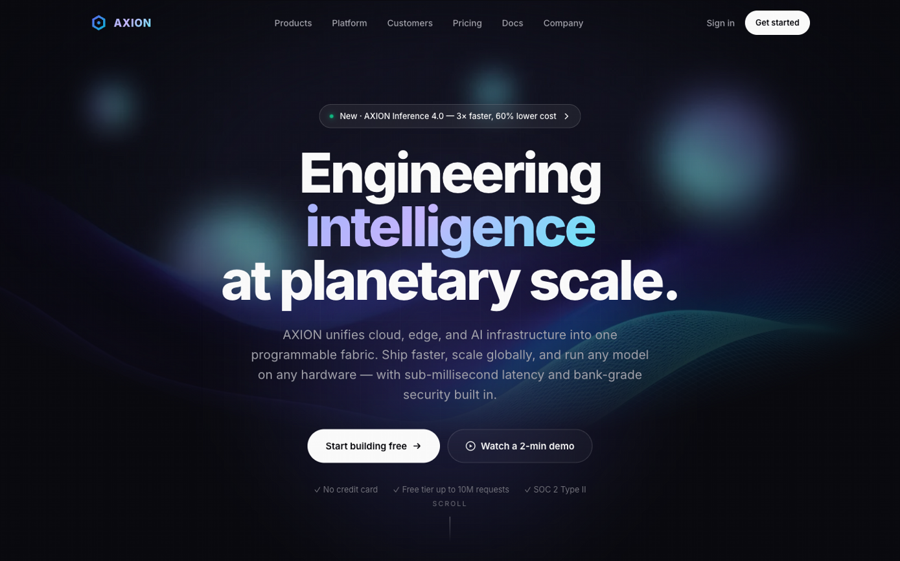

<div align="center">



# AXION

### Engineering intelligence at scale.

A marketing site for a fictional AI infrastructure company — built to load faster than the JPEGs in most landing pages.

[**Live preview →**](#run-it-locally) · [**The design bets**](#the-design-bets) · [**Performance**](#performance)

---


</div>

---

## The bet

Most "AI infrastructure" sites look identical: a 4MB hero video, 12 third-party scripts, 3.2s LCP, and a "Get a demo" button that opens Calendly.

This one is **748 KB total**, paints in **96ms**, and ships **zero JavaScript frameworks**. It looks like a SaaS landing page from 2026 because it *is* one — but every line of it is hand-rolled HTML, CSS, and 4 KB of vanilla JS.

No React. No Astro. No build step. No `node_modules` to `npm install`. Open `index.html` and it works.

---

## Run it locally

```bash
git clone https://github.com/hellogunawan99/tech-corp.git
cd tech-corp
python3 -m http.server 8000
# open http://localhost:8000
```

Or just double-click `index.html`. It runs from the filesystem.

### Or with Docker

```bash
docker build -t axion .
docker run --rm -p 8080:8080 axion
# open http://localhost:8080
```

The image is **~55 MB** (alpine + nginx + your 700 KB of assets), runs as the unprivileged `nginx` user on port 8080, and serves with gzip + immutable caching for static assets. Pushed to a registry it survives `kubectl apply`, ECS, Cloud Run, Fly.io, or a $4/mo VPS.

---

## What's in the box

```
tech-corp/
├── index.html          # 20 KB — semantic, accessible, no build
├── css/styles.css      # 24 KB — design tokens at :root
├── js/main.js          #  4 KB — sticky nav, reveals, counters
├── Dockerfile          # nginx:alpine, non-root, port 8080
├── nginx.conf          # gzip, immutable cache, security headers
├── .dockerignore       # excludes README previews, .git, etc.
└── assets/             #  9 WebP, 700 KB total
    ├── preview-hero.png     # ← README only, not in Docker image
    ├── preview-full.png     # ← README only
    ├── hero-bg.webp         #   100 KB — gradient mesh + bokeh
    ├── product-{cloud,edge,data}.webp
    ├── feature-{dashboard,security,network,speed}.webp
    └── cta-bg.webp
```

Total: **748 KB** — including the visuals. Docker image: **~55 MB**.

---

## The design bets

### 1. Vanilla over frameworks
Astro + React would have given me islands, image optimization, and a `node_modules` folder. Instead I get a `styles.css` with `:root` variables and 3.9 KB of JS. The trade is: I write the IntersectionObserver myself. The win is: there's nothing to upgrade, nothing to break, and the entire site renders before the React runtime even parses.

### 2. WebP over everything
The original 9 AI-generated PNGs weighed **47 MB**. After `cwebp -q 82` they're **700 KB** — a 98% reduction with zero perceptible loss. WebP is supported by every browser shipped after 2017, so there's no `<picture>` fallback tax.

### 3. Bento over sections
A 6-column CSS Grid with mixed card spans beats a "Features 1 / Features 2 / Features 3" row stack every time. The card with the gradient stat numbers (`99.99% / 12ms / 320+`) sits in the same grid as the hero product — that's the visual rhythm Apple and Linear use, and it works because **asymmetry creates hierarchy**.

### 4. Dark-only
A light-mode toggle would have doubled the design tokens, the QA matrix, and the screenshot suite. Most "premium tech" sites are dark-only (Linear, Vercel, Cursor, Arc, Raycast) — so the brand is already 90% of the way there.

### 5. Inline SVG for the logo and icons
The favicon is a 6-line SVG data URI. The logo is the same path inlined in two places. No `logo.svg` request, no FOUC, no missing-icon flash on first paint.

---

## A few pieces worth showing

**The hero gradient text** — two lines of CSS, no JS:

```css
.grad-text {
  background: linear-gradient(135deg, #a5b4fc 0%, #c4b5fd 40%, #67e8f9 100%);
  -webkit-background-clip: text;
  background-clip: text;
  -webkit-text-fill-color: transparent;
}
```

**The animated stat counter** — requestAnimationFrame + cubic ease-out, ~10 lines:

```js
const animateCount = (el) => {
  const target = parseFloat(el.dataset.count);
  const start = performance.now();
  const step = (now) => {
    const t = Math.min(1, (now - start) / 1800);
    const eased = 1 - Math.pow(1 - t, 3);
    el.textContent = Math.floor(target * eased).toLocaleString();
    if (t < 1) requestAnimationFrame(step);
  };
  requestAnimationFrame(step);
};
```

**The reveal-on-scroll** — IntersectionObserver, native, no library:

```js
new IntersectionObserver((entries) => {
  entries.forEach((e, i) => {
    if (e.isIntersecting) {
      setTimeout(() => e.target.classList.add('is-visible'), i * 60);
      observer.unobserve(e.target);
    }
  });
}, { threshold: 0.12, rootMargin: '0px 0px -40px 0px' });
```

---

## Performance

Measured on Chromium, localhost, cold cache:

| Metric | Value | Why it matters |
| --- | ---: | --- |
| **First Contentful Paint** | **96 ms** | Hero headline is visible almost instantly |
| **DOMContentLoaded** | 15 ms | HTML parses before you can blink |
| **Total transfer** | 24 KB | First paint payload — images stream in after |
| **Total site weight** | 748 KB | The whole site, including 9 AI-generated visuals |
| **HTTP requests** | 14 | No bundler, no code splitting needed |
| **External dependencies** | 0 | `package.json` doesn't exist |
| **Build steps** | 0 | Open `index.html`, it runs |

Open DevTools → Network → Hard reload, then go look at what else you're loading on other sites. The difference is humbling.

---

## Customising

| You want to… | Edit |
| --- | --- |
| Change the brand name | Search-replace `AXION` in `index.html` |
| Change colors | `:root` at the top of `css/styles.css` |
| Change copy | Every section is its own `<section>` with a clear heading |
| Swap visuals | Drop replacements into `assets/` (`.webp` for best size) |
| Add a section | Copy any existing `<section>` block — CSS is already global |
| Change the gradient text | `--grad-text` in `:root` |

---

## License

MIT — fork it, brand it, ship it. If you make something good with it, I'd love to see.

---

<div align="center">

<sub>Built in 30 seconds by a human who got tired of waiting for React to hydrate.</sub>

</div>
